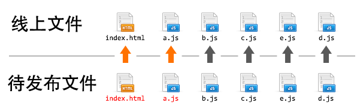

# 性能优化

## 说明

*TODO*

## 参考文章

- [雅虎14条性能优化原则](https://developer.yahoo.com/performance/rules.html)

## ChangeLog

- 2014/9/18
    - create
- 2014/9/19
    - 整理条目： **优化方向和手段** ， **静态资源版本的更新和缓存**

## 目录

*TODO*

## 正文

性能优化一般都是周期性的工作。即，在某一系列的开发工作完成之后才会进行一次代码优化操作；在开发的时候开始着手性能优化是不现实的。

### 1 优化方向和手段

| 优化方向 | 优化手段 |
| -------- | -------- |
| 请求数量 | **合并脚本和样式表** 、CSS Sprites、 **拆分初始化负载** 、划分主域 |
| 请求带宽 | 开启GZip、精简JS、 **移除重复脚本** 、图像优化 |
| 缓存利用 | 使用CDN、使用外部JS和CSS、 **添加Expires头** 、减少DNS查找、 **配置ETag** 、 **使Ajax可缓存** |
| 页面结构 | **将样式表放在顶部** 、 **将脚本放在底部** 、 **尽早刷新文档的输出** |
| 代码校验 | 避免CSS表达式、避免重定向 |

上表中列出的众多优化手段中，有一些是很容易做到的，比如 **精简JS** 可以通过现有的工具，如[YUI compressor](http://yui.github.io/yuicompressor/)来压缩JS代码。

### 2 静态资源版本的更新和缓存

我们在 **缓存利用** 中提到了多个优化手段，这里暂不谈具体如何做，而是说说使用缓存之后遇到的另一个问题： **如何更新这些缓存？** 

下面是一个一般性原则：

> 最有效的解决方案是修改其所有链接，这样，全新的请求将从原始服务器下载最新的内容。

基于这个原则，一般的做法如下（这个做法是有弊端的）：

```html
<h1>hello world</h1>
<script src="a.js?v=20140814"></script>
<script src="b.js?v=20140814"></script>
<script src="c.js?v=20140814"></script>
```

然后第二天需要发布一个升级，升级的内容是：html的结构发生更改且`a.js`内容发生变化，得到的构建结果如下：

```html
<h1>hello world, I am Pajjket.</h1>

<script src="a.js?v=20140815"></script>
<script src="b.js?v=20140815"></script>
<script src="c.js?v=20140815"></script>
```

为了触发用户浏览器的缓存更新，我们需要更改静态资源的url地址，如果采用构建信息（时间戳、版本号等）作为url修改的依据，如上述代码所示，其实我们只修改了一个`a.js`文件，但再次构建会让所有请求都更改了url地址，用户再度访问页面时，那些没有修改过的静态资源的(b.js, c.js)的浏览器缓存也一同失效了。

> 使用构建信息作为静态资源更新标记会导致每次构建发布后所有静态资源都被迫更新，浏览器缓存利用率降低，给性能带来伤害。

*观星台项目现在就是这种做法，采用`smarty`传递一个Hash串给所有的静态资源。所以每一次更新都会重新缓存所有的静态资源。*

除此之外，采用添加query的方式来清除缓存还有一个弊端，就是 **覆盖式发布** 的上线问题。



采用query更新缓存的方式实际上要覆盖线上文件的，`index.html`和`a.js`总有一个先后的顺序，从而中间出现一段或大或小的时间间隔。尤其是当 **页面是后端渲染的模板** 的时候，静态资源和模板是部署在不同的机器集群上的，上线的过程中，静态资源和页面文件的部署时间间隔可能会非常长，对于一个大型互联网应用来说即使在一个很小的时间间隔内，都有可能出现新用户访问。在这个时间间隔中，访问了网站的用户会发生什么情况呢？

* 如果先覆盖`index.html`，后覆盖`a.js`，用户在这个时间间隙访问，会得到新的index.html配合旧的a.js的情况，从而出现错误的页面。
* 如果先覆盖`a.js`，后覆盖`index.html`，用户在这个间隙访问，会得到旧的index.html配合新的a.js的情况，从而也出现了错误的页面。

对于静态资源缓存更新的问题，目前来说最优方案就是 **基于文件内容的hash版本冗余机制**。如下:

项目源码：

```html
<script src="a.js"></script>
```

发布后的代码：

```html
<script src="a_8244e91.js"></script>
```

也就是说`a.js`发布出来后被修改了文件名，产生一个新文件，并不是覆盖已有文件。其中`_82244e91`这串字符是根据`a.js`的文件内容进行hash运算得到的，只有文件内容发生变化了才会有更改。由于将文件发布为带有hash的新文件，而不是同名文件覆盖，因此不会出现上述说的那些问题。

同时，这么做还有其他的好处：

* 上线的a.js不是同名文件覆盖，而是文件名+hash的冗余，所以可以先上线静态资源，再上线html页面，不存在间隙问题
* 遇到问题回滚版本的时候，无需回滚a.js，只须回滚页面即可
* 由于静态资源版本号是文件内容的hash，因此所有静态资源可以开启永久强缓存，只有更新了内容的文件才会缓存失效，缓存利用率大增

> 以文件内容的hash值为依据生产新文件的非覆盖式发布策略是解决静态资源缓存更新最有效的手段。

虽然这种方案是相比之下最完美的解决方案，但它无法通过手工的形式来维护，因为要依靠手工的形式来计算和替换hash值，并生成相应的文件，将是一项非常繁琐且容易出错的工作，因此我们需要借助工具来处理。（ *这里暂不讨论* ）

### 3 静态资源管理与模块化框架

*TODO*